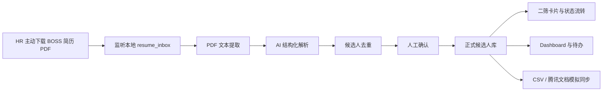

# RecruitFlow AI

招聘流程智能助手。一个非侵入式 AI 招聘流程自动化 Demo，从 HR 主动下载到本地的简历 PDF 开始，完成简历解析、人工确认、候选人管理、二筛卡片、待办提醒、招聘看板和 CSV 导出。

## 项目背景

当前招聘流程中，HR 在 BOSS 直聘完成初筛后，还需要手动下载简历、提取信息、转发给用人部门、记录状态并维护腾讯文档。RecruitFlow AI 将“下载简历”作为自动化触发点，不登录、不抓取、不绕过平台权限。

## 核心痛点

- 简历信息需要人工录入。
- 下载、转发、记录、催办重复操作多。
- 候选人状态容易遗漏或更新不及时。
- 招聘数据分散，管理者难以实时查看漏斗和堵点。

## 产品方案



## AI 使用位置

AI 仅用于简历理解、摘要、匹配点、风险点、面试问题和可选日报生成。状态流转、超时提醒、审批、统计和导出均由确定性程序规则完成。

## 最小成本设计

该方案采用“该花花、该省省”的成本原则：

- BOSS 初筛和下载保留人工确认。
- 下载后的录入、解析、转发和统计自动完成。
- 审批、状态流转、提醒、统计不调用大模型。
- 只有简历理解、摘要和日报生成使用 AI。
- 优先复用企业微信、浏览器下载目录和腾讯文档。
- Demo 使用 SQLite，正式环境可以替换为 PostgreSQL。
- Demo 使用 Mock Adapter，正式落地时再接入企业微信和腾讯文档接口。
- 先做一个岗位、一个部门的 MVP，再逐步扩展。

## 技术架构

- Frontend: Next.js, TypeScript, Tailwind CSS, Recharts
- Backend: FastAPI, Pydantic, SQLAlchemy, SQLite, PyMuPDF, watchdog
- AI: OpenAI-compatible API with structured output, plus mock mode

## 本地运行方法

后端：

```bash
cd recruitflow-ai/backend
python -m venv .venv
source .venv/bin/activate
pip install -r requirements.txt
uvicorn app.main:app --reload
```

前端：

```bash
cd recruitflow-ai/frontend
npm install
npm run dev
```

## 演示流程

1. 打开 AI 简历录入页面上传一份 PDF，或将 PDF 放入 `backend/data/resume_inbox/`。
2. 系统提取文本并生成待确认记录。
3. HR 在待确认页面修改并确认入库。
4. 候选人进入正式列表。
5. 生成并发送企业微信群二筛卡片。
6. 点击二筛通过，阶段自动变为“待约面试”。
7. Dashboard 与事件日志实时更新。
8. 导出候选人 CSV。

## 环境变量

复制 `.env.example` 为 `.env`，按需配置：

- `AI_PROVIDER=mock` 默认使用 Mock AI。
- `OPENAI_API_KEY` 仅在真实 AI 模式下需要。
- `WECOM_WEBHOOK_URL` 仅在真实企业微信群机器人推送时需要。

## 项目限制

- 不自动登录或抓取 BOSS。
- 不实现未经授权的批量下载。
- Demo 默认使用虚构数据和 Mock Adapter。
- AI 解析结果必须经人工确认后进入正式候选人看板。

## 企业正式落地路线

1. 固化一个岗位、一个部门的 MVP 流程。
2. 接入企业微信机器人和权限控制。
3. 将 SQLite 替换为 PostgreSQL。
4. 增加腾讯文档或 HRIS 的真实同步适配器。
5. 引入审计、权限、数据留存和隐私脱敏策略。
