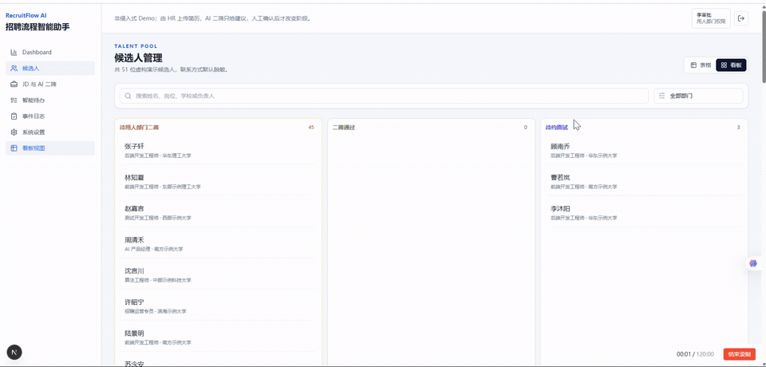
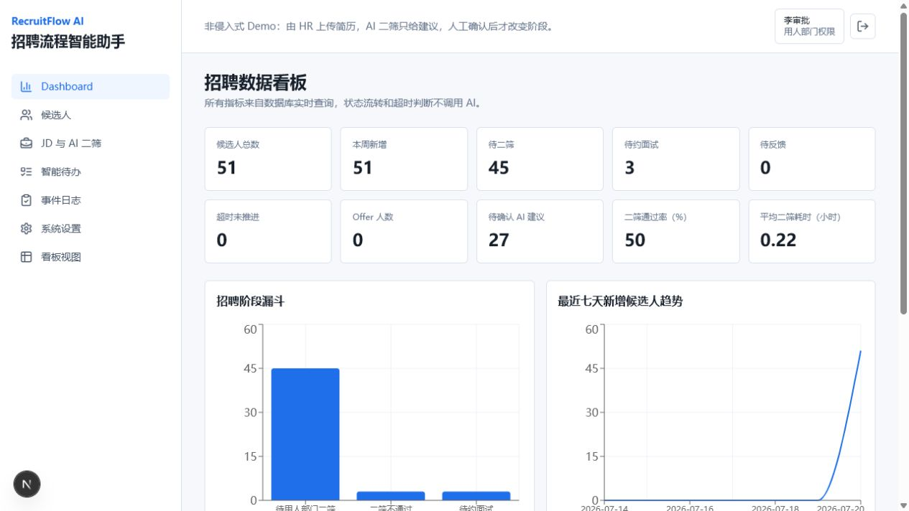
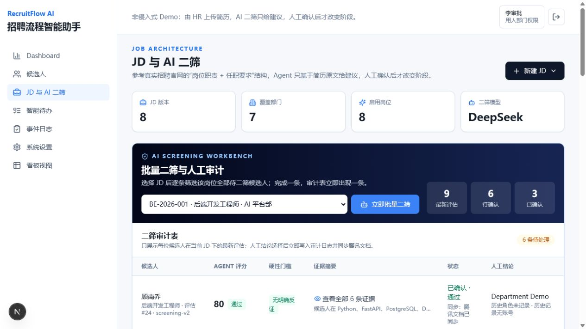
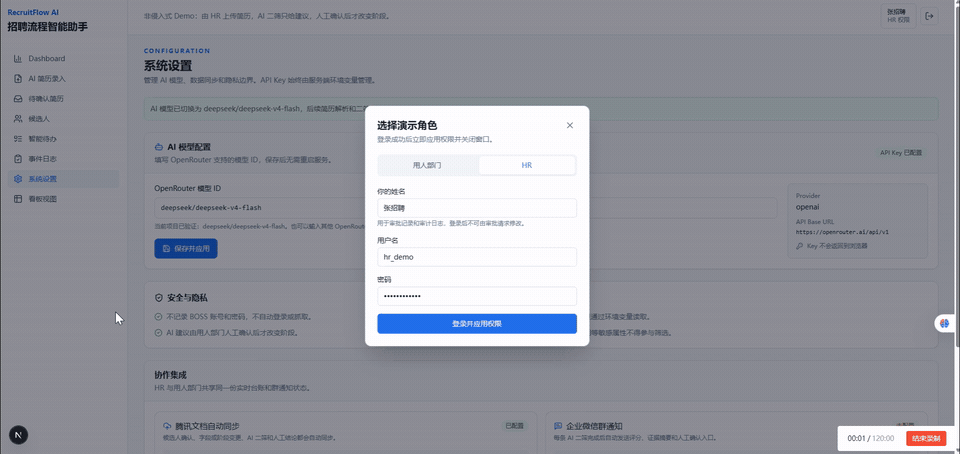
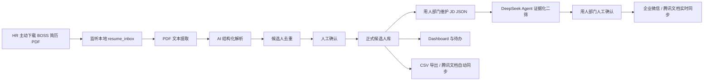

# RecruitFlow AI

招聘流程智能助手。一个非侵入式 AI 招聘流程自动化 Demo，从 HR 主动下载到本地的简历 PDF 开始，完成简历解析、人工确认、候选人管理、证据化二筛、待办提醒、招聘看板、腾讯文档同步和企业微信通知。当前演示数据覆盖 7 个用人部门、8 个 JD 版本和 50 份虚构候选人简历。

## 在线预览

- Demo：<http://159.226.85.196:8021>
- 用人部门与 HR 均通过弹窗登录；登录人姓名会写入审批记录和事件审计。
- 演示数据全部为虚构数据，AI 只给出建议，人工确认后才改变招聘阶段。

## 功能 Demo

### 用人部门查询候选人信息

用人部门可以按招聘阶段浏览候选人，进入详情页查看脱敏联系方式、教育背景、AI 二筛结论及逐项证据。



## 页面预览

### 招聘数据看板



### 批量二筛与人工审计



## 功能 Demo

### 1. 角色切换

在不同招聘角色之间快速切换，让每个角色进入与其职责对应的工作视图。



## 项目背景

当前招聘流程中，HR 在 BOSS 直聘完成初筛后，还需要手动下载简历、提取信息、转发给用人部门、记录状态并维护腾讯文档。RecruitFlow AI 将“下载简历”作为自动化触发点，不登录、不抓取、不绕过平台权限。

## 核心痛点

- 简历信息需要人工录入。
- 下载、转发、记录、催办重复操作多。
- 候选人状态容易遗漏或更新不及时。
- 招聘数据分散，管理者难以实时查看漏斗和堵点。

## 产品方案



## AI 使用位置

AI 用于简历理解，以及根据版本化 JD 对候选人进行证据化二筛。Agent 的每个匹配结论必须引用简历原文；总分、阈值判定、状态流转、超时提醒、审批、统计和导出由确定性程序规则完成。Agent 只给建议，用人部门确认后才改变招聘阶段。

## 最小成本设计

该方案采用“该花花、该省省”的成本原则：

- BOSS 初筛和下载保留人工确认。
- 下载后的录入、解析、转发和统计自动完成。
- 审批、状态流转、提醒、统计不调用大模型。
- 只有简历理解和 JD 二筛使用 AI；每次二筛记录模型、Prompt 版本、Token 与实际 API 成本。
- 优先复用企业微信、浏览器下载目录和腾讯文档。
- Demo 使用 SQLite，正式环境可以替换为 PostgreSQL。
- 企业微信支持群机器人 Webhook；腾讯文档通过官方 MCP 接口按候选人固定行增量覆盖更新，避免重复记录。
- 用 7 个部门、8 个 JD 和 50 份虚构简历覆盖岗位重合与不重合场景，数据生成过程可重复执行。

## 技术架构

- Frontend: Next.js, TypeScript, Tailwind CSS, Recharts
- Backend: FastAPI, Pydantic, SQLAlchemy, SQLite, PyMuPDF, watchdog
- AI: OpenRouter `deepseek/deepseek-v4-flash` structured output，简历证据引用校验
- Auth: 签名时效 Token，HR / 用人部门角色权限
- Migration: 内置版本化数据库迁移表 `schema_migrations`

## 本地运行方法

后端：

```bash
cd recruitflow-ai/backend
python -m venv .venv
source .venv/bin/activate
pip install -r requirements.txt
python -m scripts.seed_demo_dataset
uvicorn app.main:app --reload
```

当前 Codex Windows 环境里如果存在外部 pytest 插件冲突，可用下面命令只运行本项目测试：

```powershell
$env:PYTEST_DISABLE_PLUGIN_AUTOLOAD='1'; python -m pytest
```

前端（Node.js 20.9 或更高版本）：

```bash
cd recruitflow-ai/frontend
npm install
npm run dev
```

Docker：

```bash
cd recruitflow-ai
cp .env.example .env
docker compose up --build
```

## 演示流程

1. 打开 AI 简历录入页面上传一份 PDF，或将 PDF 放入 `backend/data/resume_inbox/`。
2. 系统提取文本并生成待确认记录。
3. HR 在待确认页面修改并确认入库。
4. 候选人进入正式列表。
5. 用人部门登录，在“JD 与 AI 二筛”页面提交并校验 JD JSON。
6. 候选人详情页选择 JD，使用 DeepSeek V4 Flash 生成带原文证据的二筛建议。
7. 在招聘阶段不变的情况下检查 Agent 分数、风险点、问题、Token 和成本。
8. 用人部门确认结论后，阶段变为“待约面试”，并同步腾讯文档及审计日志。
9. 将带分数、证据和确认入口的二筛通知发送到企业微信群。
10. Dashboard 查看通过率、待确认建议和平均二筛耗时。

## 环境变量

复制 `.env.example` 为 `.env`，按需配置：

- `AI_PROVIDER=mock` 默认使用 Mock AI。
- `OPENAI_API_KEY` 仅在真实 AI 模式下需要。
- `WECOM_WEBHOOK_URL` 仅在真实企业微信群机器人推送时需要，必须填写群机器人提供的 `https://qyapi.weixin.qq.com/cgi-bin/webhook/send?key=...` 发送地址；`openBotProfile` 管理页链接不能用于发送消息。
- `TENCENT_DOCS_TOKEN` 从腾讯文档 MCP 授权页获取，不得提交到代码仓库。
- `TENCENT_DOCS_FILE_ID` 和 `TENCENT_DOCS_SHEET_ID` 是可选的已有目标；不填写时系统会自动创建在线表格并保存生成的 ID。
- `TENCENT_DOCS_MCP_URL` 默认使用官方 `https://docs.qq.com/openapi/mcp`。
- `AUTH_SECRET`、两个 Demo 密码在部署时必须更换；`.env` 不得提交。
- `PUBLIC_APP_URL` 用于企业微信通知中的人工确认入口，部署后应改为公网 HTTPS 地址。

## 腾讯文档真实同步

1. 访问 `https://docs.qq.com/open/auth/mcp.html` 获取个人 Token。
2. 将 Token 写入本地 `.env`；文档 ID 和工作表 ID 可以留空。
3. 启动后端后，在系统设置页点击“同步到腾讯文档”。首次同步会自动创建在线表格。

首次同步会写入表头和现有候选人；之后将变化写回候选人 ID 对应的固定行，不产生重复版本。表格包含 JD 编号、AI 匹配分、Agent 建议和人工结论。同步游标仅在腾讯文档确认成功后推进，接口错误会直接返回，不会伪装成成功。

## 项目限制

- 不自动登录或抓取 BOSS。
- 不实现未经授权的批量下载。
- Demo 默认使用虚构数据；腾讯文档和企业微信只有配置真实凭证后才会发送数据。
- AI 简历解析结果必须经 HR 确认后进入正式候选人看板；Agent 二筛建议必须经用人部门确认后才改变阶段。

## 登录与角色

本地 Demo 默认账号：

- 用人部门：`department_demo / department-demo-2026`
- HR：`hr_demo / hr-demo-2026`

这些账号仅用于本地演示。公网部署前必须通过环境变量更换用户名、密码与 `AUTH_SECRET`。

## 已验证演示证据

- `output/audit/06-latest-dashboard.png`：51 名候选人的实时招聘指标与图表。
- `output/audit/07-latest-screening-workbench.png`：批量二筛、证据摘要、人工结论和审计状态。
- `output/audit/03-agent-screening.png`：DeepSeek 二筛分数与逐项简历证据。
- `output/audit/04-screening-confirmed.png`：人工确认与事件审计记录。
- `output/audit/05-dashboard-screening-metrics.png`：二筛通过率、待确认量和平均耗时。

## 企业正式落地路线

1. 固化一个岗位、一个部门的 MVP 流程。
2. 将本地 Demo 账号替换为企业统一身份认证，并配置真实企业微信群机器人。
3. 将 SQLite 替换为 PostgreSQL。
4. 增加腾讯文档或 HRIS 的真实同步适配器。
5. 引入审计、权限、数据留存和隐私脱敏策略。

## API 文档

启动后端后访问 `http://localhost:8000/docs` 查看 OpenAPI 文档。仓库内的静态接口说明见 `docs/api.md`。
