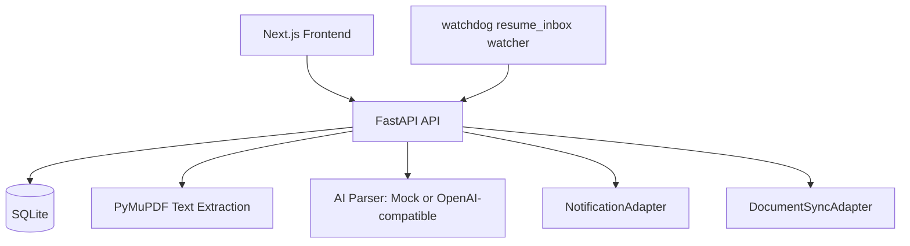
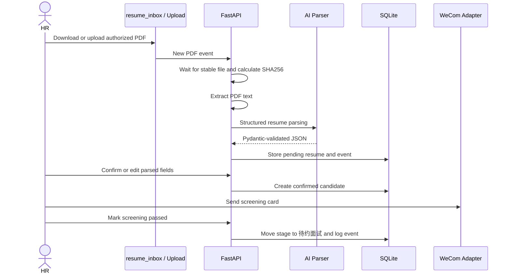

# Architecture

## Boundaries

- Parsing stays in backend resume services.
- AI is limited to structured extraction and generated summaries.
- Recruitment stage transitions are deterministic application rules.
- Notification and document sync are adapter-based integrations.

## Recruitment Flow

## Data Model

- `candidates`: confirmed and active candidate records.
- `resume_files`: uploaded or discovered resume files and AI parsing payloads.
- `recruitment_events`: audit trail for ingestion, parsing, confirmation, stage changes, notifications, and export.
- `interview_records`: interview schedule and feedback.
- `notification_logs`: mock or real WeCom send logs.
- `system_settings`: small operational settings such as last CSV sync time.
