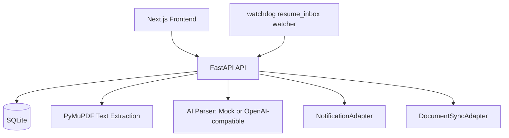

# Architecture

## Boundaries

- Parsing stays in backend resume services.
- AI is limited to structured extraction and generated summaries.
- Recruitment stage transitions are deterministic application rules.
- Notification and document sync are adapter-based integrations.
